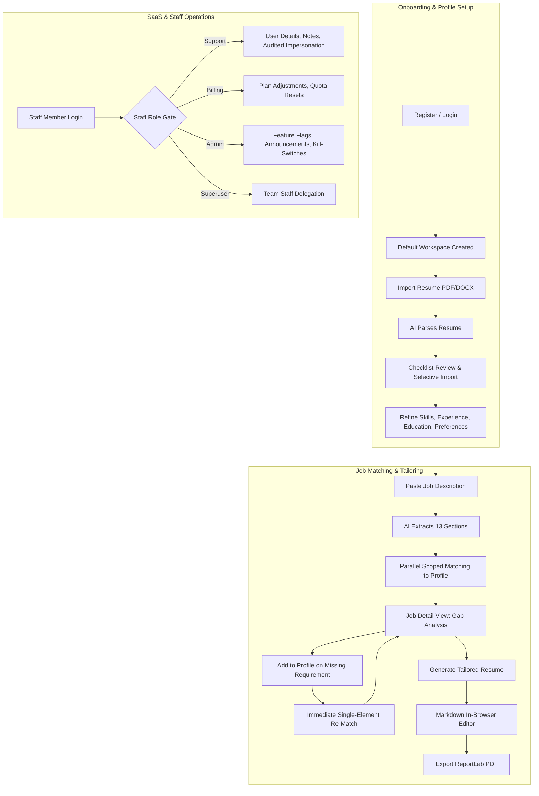

# Easy Apply — System Use Cases Specification

## 1. Executive Summary & Architectural Context

Easy Apply is an AI-assisted career companion and SaaS platform designed to streamline the job application lifecycle. It bridges candidate qualifications and complex job descriptions through automated extraction, fine-grained semantic matching, profile enrichment, tailored resume drafting, and PDF generation.

The system is built on Django 5.2 LTS, Celery, Redis, and PostgreSQL (SQLite in WAL mode for local development), interfacing with DeepSeek AI models.

### Key Architectural Pillars

1. **Profile-Centric Workspace Isolation:**
   All candidate data (skills, languages, work experiences, education degrees, certificates, preferences, job postings, resume imports, and tailored resumes) belongs strictly to an `accounts.Profile` workspace, not directly to `auth.User`. A user may maintain multiple profiles (e.g., "Full-Stack Engineer (English)", "Ingénieur Logiciel (Français)") with independent data sets and language contracts.

2. **Strict Profile Language Invariance:**
   Each profile has an immutable `language` (e.g., `en`, `fr`). All AI interactions—from prompt construction via `core.language.language_clause` to document extraction, section evaluation, and ReportLab PDF rendering—run under the profile's explicit language context (`core.language.use_language`), regardless of the user's browser language.

3. **Scoped Profile Slices for Cost and Precision Optimization:**
   Instead of feeding entire candidate profiles into Large Language Model (LLM) prompts, matching jobs against profiles uses sliced representations (`core.services.build_profile_slice`). For example, technical requirements are matched only against technical skills, work arrangement against location preferences, etc. If a slice is empty, AI calls are skipped completely with an informative fallback notice, saving LLM tokens and execution time.

4. **Fault-Tolerant Celery Pipelines with Chord Isolation:**
   Job analysis uses a Celery workflow: `chain(read_job_text -> extract_job_sections)` fanning out into a `chord` of parallel `group(match_job_section)` tasks, converging at `finalize_job_analysis`. If an individual section match fails (e.g., timeout or rate limit), it records its own failure state without poisoning the chord. The user can retry individual sections directly from the UI tab.

5. **SaaS Governance, Metering, and Defensive Administration:**
   The `staffportal` app provides role-based access control (Viewer, Support, Billing, Admin, Superuser), plan allowances (`Plan`, `Subscription`, `UsageRecord`), dynamic feature flags (`FeatureFlag`), runtime system settings with emergency kill switches (`SystemSetting`), site-wide announcements (`Announcement`), audited time-limited user impersonation (`ImpersonationSession`), append-only audit logging (`AuditLog`), and GDPR Art. 17/20 data portability and erasure.

---

## 2. Actors & Personas

| Actor | Description | Privileges & Context |
| :--- | :--- | :--- |
| **Anonymous Visitor** | Unauthenticated user visiting public web pages. | Can view landing page, pricing page, public legal policies (Privacy, Terms, Cookies, Legal Notice, Contact), sign in, or register an account (subject to the `signups_enabled` switch). |
| **Candidate / Job Seeker** | Authenticated standard user. | Manages profiles/workspaces, records qualifications and job preferences, imports existing resumes, analyzes job postings, adds missing skills directly from job requirements, and generates tailored resumes and PDFs. Subject to monthly plan quotas. |
| **Support Operator** | Staff account assigned the `support` role. | Can view customer accounts, search/filter user lists, view detailed user state and tasks, record internal support notes, trigger password resets, download GDPR exports, and initiate audited, time-limited customer impersonation sessions. |
| **Billing Operator** | Staff account assigned the `billing` role. | Inherits all Support capabilities, plus authority to view and update user subscriptions, switch customer plans, adjust billing statuses, and reset monthly usage counters (goodwill compensation). |
| **System Administrator** | Staff account assigned the `admin` role. | Inherits all Billing capabilities, plus managing plan definitions, feature flags (global, percentages, user overrides), runtime system settings (kill switches), announcements, operational Celery queues, and performing customer account erasures. |
| **Superuser** | Account with `is_superuser=True`. | Holds all portal and Django administrative privileges. The only actor permitted to manage team staff access (`StaffMember`), elevate staff roles, and impersonate or delete other staff/superuser accounts. |
| **Background AI Worker** | Celery distributed task runner executing tasks. | Asynchronously processes document parsing, DeepSeek job extraction, scoped section matching, element re-evaluations, and tailored resume authoring. Bounded by soft/hard time limits and retry guards. |

---

## 3. Master Use Case Catalog

The complete catalog of use cases is detailed across modular specifications within the `docs/use-cases/` directory:

### [UC-01: Identity, Authentication & Account Security](file:///home/sami/PycharmProjects/Github/easy-apply/docs/use-cases/UC01_IDENTITY_AUTH_SECURITY.md)
- **UC-01.1**: User Registration & Auto-Subscription
- **UC-01.2**: Email Authentication & Session Inception
- **UC-01.3**: Password Reset via Cryptographic Token
- **UC-01.4**: Credential Modification (Password Change)
- **UC-01.5**: Secure User Logout & Session Invalidation
- **UC-01.6**: Self-Service Account Erasure (GDPR Art. 17)

### [UC-02: Workspaces & Multi-Profile Management](file:///home/sami/PycharmProjects/Github/easy-apply/docs/use-cases/UC02_PROFILE_WORKSPACES.md)
- **UC-02.1**: Workspace / Profile Creation with Immutable Language Contract
- **UC-02.2**: Active Workspace Switching & Locale Activation
- **UC-02.3**: Profile Metadata & Contact Information Updates
- **UC-02.4**: Workspace Renaming & Deletion Guards
- **UC-02.5**: Full Profile Recap Export & Markdown Preview

### [UC-03: Candidate Profile Data Management](file:///home/sami/PycharmProjects/Github/easy-apply/docs/use-cases/UC03_PROFILE_DATA_MANAGEMENT.md)
- **UC-03.1**: Technical Skills Management by Category Tabs
- **UC-03.2**: Soft Skills Management & Categorization
- **UC-03.3**: Multilingual Language Proficiencies Management
- **UC-03.4**: Professional Work Experience & Granular Highlights
- **UC-03.5**: Education Degrees & Professional Certifications
- **UC-03.6**: Career Preferences, Work Arrangements & Benefits Prioritization

### [UC-04: Resume Parsing & Automated Profile Onboarding](file:///home/sami/PycharmProjects/Github/easy-apply/docs/use-cases/UC04_RESUME_PARSING_ONBOARDING.md)
- **UC-04.1**: Multi-Format Resume Upload & Quota Validation (PDF, DOCX, TXT)
- **UC-04.2**: Background Asynchronous Extraction via DeepSeek LLM
- **UC-04.3**: Intelligent Collision & Duplicate Detection
- **UC-04.4**: Interactive Review Checklist & Transactional Selective Import

### [UC-05: Job Posting Ingestion & Scoped Semantic Matching](file:///home/sami/PycharmProjects/Github/easy-apply/docs/use-cases/UC05_JOB_POSTING_MATCHING.md)
- **UC-05.1**: Job Posting Creation & Allowance Verification
- **UC-05.2**: 13-Section Deep Extraction Pipeline (Celery Chain)
- **UC-05.3**: Scoped Profile Slice Matching (Celery Chord Fan-Out)
- **UC-05.4**: Zero-Cost Empty Slice Handling
- **UC-05.5**: Non-Poisoning Fault Isolation & Per-Section Tab Retries
- **UC-05.6**: Real-Time Unified State Polling (`/state/` API Contract)
- **UC-05.7**: Full Job Re-Analysis vs. Profile Re-Match

### [UC-06: Interactive Requirement Gap-Closing ("Add to Profile")](file:///home/sami/PycharmProjects/Github/easy-apply/docs/use-cases/UC06_INTERACTIVE_ADD_TO_PROFILE.md)
- **UC-06.1**: Missing Element Detection & Modal Form Rendering
- **UC-06.2**: Contextual Form Pre-filling & Dynamic Target Mapping
- **UC-06.3**: Profile Record Creation & Targeted Single-Element Re-Evaluation

### [UC-07: Tailored Resume Authoring & PDF Export](file:///home/sami/PycharmProjects/Github/easy-apply/docs/use-cases/UC07_TAILORED_RESUME_GENERATION.md)
- **UC-07.1**: AI Generation of Job-Tailored Resume Draft
- **UC-07.2**: Interactive Markdown In-Browser Editing & Modification Tracking
- **UC-07.3**: ReportLab PDF Compilation with Strict Language Formatting
- **UC-07.4**: Raw Markdown Export & Tailored Resume Lifecycle

### [UC-08: Staff Operator Portal & SaaS Administration](file:///home/sami/PycharmProjects/Github/easy-apply/docs/use-cases/UC08_STAFF_OPERATIONS_ADMIN.md)
- **UC-08.1**: Granular Role-Based Access Control & Portal Obfuscation (HTTP 404 Guard)
- **UC-08.2**: Customer Account Administration, Filtering & Session-Flushing Suspension
- **UC-08.3**: Audited, Time-Limited Customer Impersonation
- **UC-08.4**: Internal Customer Support Annotations (Pinned Notes)
- **UC-08.5**: Plan Tier Definition & Subscription Management
- **UC-08.6**: Dynamic Deterministic Feature Flags & Account Overrides
- **UC-08.7**: Runtime Configuration & Emergency Service Kill Switches
- **UC-08.8**: Site-Wide Customer Announcements & In-App Banners
- **UC-08.9**: Asynchronous Celery Queue Inspection & Task Re-dispatch
- **UC-08.10**: Immutable Append-Only Audit Logging & Retention
- **UC-08.11**: GDPR Art. 20 JSON Portability & Operator-Initiated Account Erasure

### [UC-09: Legal Compliance, Localization & Cross-Cutting Concerns](file:///home/sami/PycharmProjects/Github/easy-apply/docs/use-cases/UC09_COMPLIANCE_LOCALIZATION.md)
- **UC-09.1**: Public Static Legal Framework (Privacy, Terms, Cookies, Legal Notice)
- **UC-09.2**: Dynamic Entity Configuration via Settings
- **UC-09.3**: Full Dual-Tier Localization (UI Switcher vs. Profile Language Invariant)
- **UC-09.4**: Polling Architecture & Real-Time Task Progress Contract (`AITask`)

---

## 4. Use Case Interaction Model

