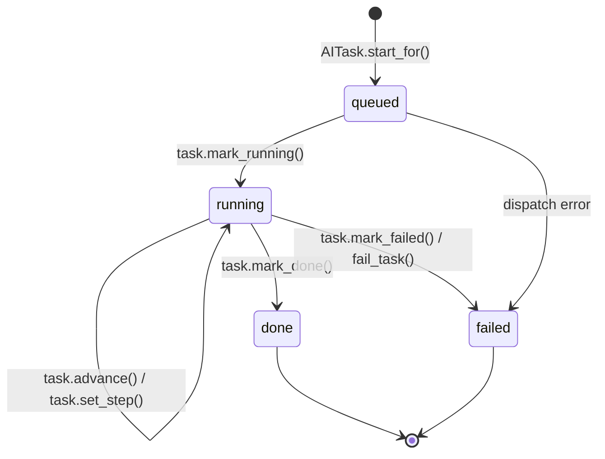

# Use Case Group 09: Legal Compliance, Localization & Cross-Cutting Architecture

## System Scope
This group addresses cross-cutting architectural invariants in Easy Apply:
- `legal`: Compliance with European and international privacy frameworks (GDPR, ePrivacy, CCPA).
- `core.language`: Dual-tier internationalization separating browser UI preferences from profile-scoped data and AI outputs.
- `core.tasks`: The unified asynchronous progress contract powering live front-end feedback across all background pipelines.

---

## UC-09.1: Public Static Legal Framework

- **Primary Actor:** Anonymous Visitor / Candidate
- **Supporting System:** `legal.views.LegalPageView`, `legal.urls`
- **Objective:** Provide accessible, transparent, legally compliant policies regarding data processing, terms of use, cookies, and identity.

### Main Success Scenario
1. Visitor navigates to any footer legal route:
   - `/legal/privacy/`: Privacy Policy detailing data collection, AI processing disclosure, and user rights ([`legal:privacy`](file:///home/sami/PycharmProjects/Github/easy-apply/legal/views.py#L22)).
   - `/legal/terms/`: Terms of Service covering acceptable usage, IP, and plan subscription rules ([`legal:terms`](file:///home/sami/PycharmProjects/Github/easy-apply/legal/views.py#L27)).
   - `/legal/cookies/`: Cookie policy clarifying session cookies and zero non-essential tracking ([`legal:cookies`](file:///home/sami/PycharmProjects/Github/easy-apply/legal/views.py#L32)).
   - `/legal/notice/`: Legal Notice (Impressum / Mentions légales) ([`legal:notice`](file:///home/sami/PycharmProjects/Github/easy-apply/legal/views.py#L37)).
   - `/legal/contact/`: Direct support and DPO contact information ([`legal:contact`](file:///home/sami/PycharmProjects/Github/easy-apply/legal/views.py#L42)).
2. Pages render cleanly in the user's active UI language with canonical breadcrumbs.

### Key Code References
- Views: [`legal.views.LegalPageView`](file:///home/sami/PycharmProjects/Github/easy-apply/legal/views.py#L5)
- Templates: `templates/legal/*.html`

---

## UC-09.2: Dynamic Entity Configuration via Settings

- **Primary Actor:** System Administrator (Deployment / Ops)
- **Supporting System:** `settings.LEGAL_ENTITY`
- **Objective:** Dynamically inject legal operator details into translated policy documents from a centralized configuration dictionary.

### Main Success Scenario
1. The deployment environment declares legal parameters in `settings.py`:
   ```python
   LEGAL_ENTITY = {
       "name": "Easy Apply SAS",
       "address": "123 Avenue de France, 75013 Paris, France",
       "jurisdiction": "Tribunal de Commerce de Paris",
       "hosting_provider": "Scaleway SAS",
       "dpo_email": "dpo@easy-apply.com",
       "support_email": "support@easy-apply.com",
   }
   ```
2. Legal views pass these values via context processors to the policy templates.
3. Policy pages automatically interpolate legal addresses, registration IDs, hosting providers, and contact channels without hardcoded text changes.

---

## UC-09.3: Dual-Tier Localization (UI Switcher vs. Profile Language Invariant)

- **Primary Actor:** Candidate
- **Supporting System:** `core.language`, `django.utils.translation`
- **Objective:** Maintain strict architectural separation between transient interface language and permanent workspace/AI document language.

### Dual-Tier Model Architecture
1. **Tier 1 — Interface Language (UI Chrome):**
   - Controls navigation labels, buttons, headers, and form help text.
   - User can switch anytime via the language switcher dropdown in the footer or navigation bar.
   - Handled via standard Django `set_language` redirect and `django_language` cookie.
2. **Tier 2 — Profile Language (Workspace Invariant):**
   - Configured upon profile creation and **cannot be modified**.
   - Governs all DeepSeek AI prompts (`language_clause(profile.language)`).
   - Dictates the language of extracted job requirements, match evidence, tailored resume text, and PDF date formatting.

### Main Success Scenario
1. Suppose a candidate has a French profile workspace (`profile.language = "fr"`).
2. Even if the candidate temporarily toggles the website UI to English:
   - When they analyze a job post or re-match a requirement, the AI prompt explicitly includes:
     > *"Respond entirely in French. All section titles, requirement descriptions, and evaluation evidence must be written in French."*
   - When generating a tailored resume or downloading a Markdown recap, system wraps generation in:
     ```python
     with use_language(profile.language):
         # duration rendered as "janv. 2020 – Aujourd'hui"
         # headings rendered as "Expérience professionnelle", "Compétences"
         return render_markdown_pdf(...)
     ```
   - As a result, the produced resume and career documents remain 100% linguistically consistent and free of corrupted mixed-language output.

### Key Code References
- Language Utilities: [`core.language`](file:///home/sami/PycharmProjects/Github/easy-apply/core/language.py)
- Recap Builder: [`core.utils.generate_markdown_recap`](file:///home/sami/PycharmProjects/Github/easy-apply/core/utils.py#L24)

---

## UC-09.4: Polling Architecture & Real-Time Task Progress Contract (`AITask`)

- **Primary Actor:** Candidate (Browser Client / Alpine.js)
- **Supporting System:** `core.models.AITask`, `core.views.AITaskStatusView`
- **Objective:** Track multi-step background Celery execution reliably without WebSockets, surviving long-running LLM calls and network blips.

### State Transition Diagram


### Main Success Scenario
1. A background operation is queued (e.g. `resume_import`, `job_analysis`, `job_match`, or `tailored_resume`).
2. Server creates an `AITask` record containing:
   - `kind`: Task type
   - `state`: `queued`, `running`, `done`, or `failed`
   - `percent`: 0 to 100
   - `steps_done` and `steps_total`
   - `current_step`: Localized descriptive text (e.g., *"Reading the job posting"*, *"Extracting sections"*)
   - `is_indeterminate`: `True` if total steps cannot be predicted up front.
3. Front-end Alpine.js component polls `GET /tasks/<task_id>/status/` ([`core:task_status`](file:///home/sami/PycharmProjects/Github/easy-apply/core/views.py#L129)):
   - Verifies owner security (`task.user == request.user`). Returns HTTP 404 if accessed by another user.
   - Front-end updates the progress bar percentage and current step message.
4. When `task.is_terminal` (`state in (DONE, FAILED)`) is reached:
   - If `done`: Front-end reads `redirect_url` provided in the JSON payload (e.g. review screen or tailored resume editor) and executes seamless browser redirect.
   - If `failed`: Polling ceases; an inline alert displays `task.error_message` with a *"Retry"* button.

### Key Code References
- Model: [`core.models.AITask`](file:///home/sami/PycharmProjects/Github/easy-apply/core/models.py)
- View: [`core.views.AITaskStatusView`](file:///home/sami/PycharmProjects/Github/easy-apply/core/views.py#L129-L168)
- Task Helpers: [`core.tasks`](file:///home/sami/PycharmProjects/Github/easy-apply/core/tasks.py)
